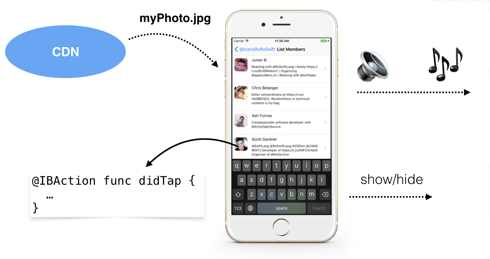
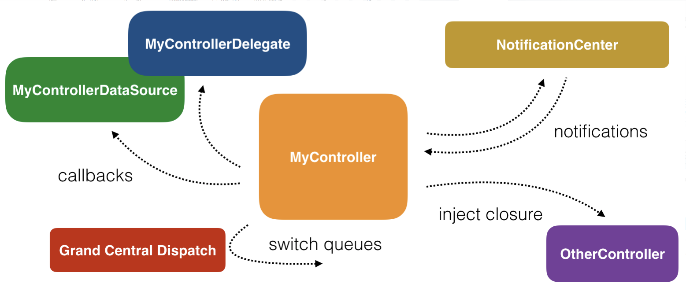
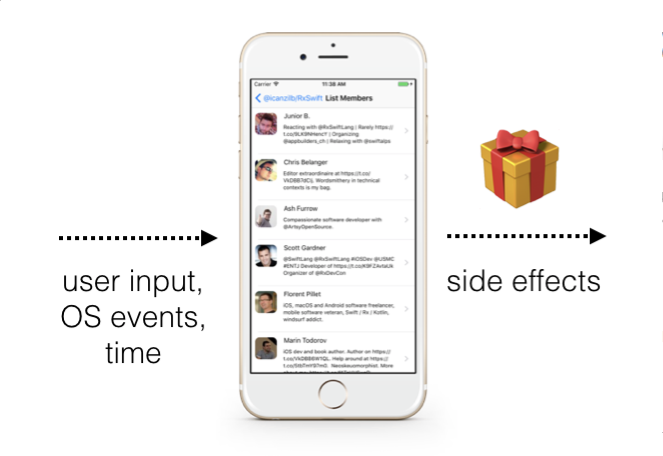

# 1.1 异步编程简介

如果你尝试使用简单、接地气儿的言语来解释异步编程，那么可能会遇到以下一些状况。

一个 iOS app 可能在任意时刻同时进行着多个任务：

- 响应按钮点击
- 文本输入框失焦时动态隐藏键盘
- 从网上下载一个大图片
- 将一些数据保存到磁盘
- 播放音频
- 等等……

所有这些事情都好像在同一个时间发生。每当键盘弹出到弹出动画结束，你的音乐都一直在播放着未曾暂停，是吧？



你的程序的各个功能组件都不会阻止彼此的执行。iOS 为你提供了各种 APIs，让你可以通过设备CPU的不同核心将不同的任务运行在不同的线程上。

然而，要写出真正并行的代码是相当复杂的，特别是当不同的代码要用到同一个数据。很难确定是哪些代码先更新了数据，哪些代码拿到了最新值。


## Cocoa 和 UIKit 的异步 APIs

苹果在 iOS SDK 中提供了大量的 APIs 来帮助你编写异步代码。你可能已经在你的项目中用到它们但没注意到，毕竟他们是编写移动应用的基础。

你可能已经使用过下边大部分内容：

- **通知中心（NotificationCenter）**：无论何时，一旦你关注的事件发生时便执行你的代码，比如用户改变了屏幕方向或者是软键盘的出现或隐藏。
- **代理模式（The delegate pattern）**：由其它类或 API 定义的、会在某些时间点被执行的方法。打个比方，你的应用代理定义了当一个新的远程通知到达时应该执行一些代码，但你并无法确定这些代码什么时候会被执行、会执行多少次。
- **GCD（Grand Central Dispatch）**：帮你对要执行的任务进行抽象。你可以让代码在串行队列中依序执行，也可以在拥有不同优先级的各个并行队列上同时执行多个任务。
- **闭包（Closures）**：可以创建一段函数，该函数可以在类之间传递，每个类可以自行决定是否执行该函数，以及要执行多少次、在什么样的上下文（context）中执行。

由于大多时候你编写的类都将异步工作，且所有 UI 组件本质也是异步工作的，所以不可能对你的应用整体上会以什么顺序运行做出假设。

毕竟，你的应用代码会由于各种外部因素，比如用户输入、网络活动、或其他系统事件等，而出现不同的执行情况。（当然了，一种情况除外，就是你有一个团的机器人在帮你测试app，这时候你就能精确的预测所有事件了。）

我们绝不是说要编写运行良好的异步代码是不可能的。毕竟，上边列出的苹果提供的大量 APIs 是非常先进和专业的，且和其他平台相比而言，十分直观、强大。

不过问题是，复杂的异步代码变得不好写的一部分原因恰恰是因为苹果提供的 APIs：



异步编程主要使用上边提到的几种方式：使用代理的话需要你先确定要采用的模式 —— DataSource 还是 Delegate，使用通知中心需要进行订阅，还有就是直接使用闭包，等等。这些异步 APIs 没有统一的方式来进行通信，这使得对代码的阅读和理解，以及推断它的运行情况变得困难。

为了对这一部分做一个小结，并且在更大的上下文中讨论这些问题，你将对两段代码进行对比：一段同步代码，和一段异步代码。

**同步代码**

对数组中的每个元素执行某个操作这样的任务想必你做过很多次了。这是一个非常简单但又十分可靠的代码块，因为它保证了两件事：它是同步执行的，并且迭代过程中集合是不可变的。

花点时间想一下这话意味着什么。这意味着，当你对集合进行迭代操作时，你不需要检查所有元素是否还在，也不需要倒回去检查是否有其他线程在集合的开头插入了新的元素。你可以确定你每次进行迭代操作的集合都是循环开始时的那个集合。

如果你想在这方面对这个 for 循环玩点其他花样儿，请在 playground 中输入以下代码：

```
var array = [1, 2, 3] 
for number in array {
    print(number)
    array = [4, 5, 6] 
} 
print(array)
```

思考一下，array 变量 是否在 for 循环体内被改变了？此时正在进行迭代操作的集合是否也更着改变？所有命令的执行顺序是怎样的？也可以对 number 变量进行修改吗？

**异步代码**

考虑下边一段类似的代码，但把一次迭代假设是按了一下按钮。当用户反复点击按钮是，应用将会打印出数组中的下一个元素：

```
var array = [1, 2, 3] 
var currentIndex = 0

//该方法在 IB 中连接到某个按钮
@IBAction func printNext(_ sender: Any { 
    print(array[currentIndex])

    if currentIndex != array.count-1 { 
        currentIndex += 1 
    }
}
```

考虑下把上边两段代码放一块会怎样？当用户点击按钮时，它还能跟原来一样顺利打印出数组中的所有元素吗？还真不能下这样的结论。可能在还没打印完时，数组中最后的元素已经被其他地方的异步代码移除了。

又或者当你按下按钮刚抬起手指，数组开头被其他地方的异步代码插入了新的元素。

同样的，你以为只有`printNext(_:)`函数会改变`currentIndex`值，但其实其他地方的代码也可能修改`currentIndex`的值——比如写完`printNext(_:)`函数后，你又在其他地方写了一些聪明的代码，这些代码刚好也能修改`currentIndex`值。

你可能已经意识到编写异步代码的一些核心问题：

a) 代码执行的顺序；

b) 共享的可变数据。

幸运的是，处理这些问题是 RxSwift 的强项！

接下来，你需要一份针对一些专业用语的优秀指南，以便帮助你理解 RxSwift 的工作原理以及它所要解决的问题，并最终结束这章讲述得比较缓慢的介绍，让你进入下一章，开始编写第一个 Rx 程序。


## 异步编程常见术语

RxSwift 中有一些专业用语紧紧围绕着异步、响应式、函数式编程等概念，先了解一下以下的基本术语能让你在后边比较轻松。

一般来说，RxSwift 尝试解决以下问题：

**1. 状态，特别是共享的、可变的状态（State, and specifically, shared mutable state）**

状态有点难以界定。为了理解状态，请考虑以下实际例子。

当你启动你的笔记本电脑，起初运行良好，但是用了几天或者几个星期后，电脑开始出现异常，或者干脆死机罢工。硬件和软件并没有变化，变的是状态。但你一重启，就又正常如初了，还是原来的硬件和软件。

内存数据，磁盘存储，所有用户输入的产物，从云服务中获取数据留下的痕迹——这些都是你笔记本电脑的状态。

本书中你将学习如何去解决的问题之一，就是学会管理应用状态，特别是在多个异步组件间共享状态。

**2. 命令式编程（Imperative programming）**

命令是编程是一种使用语句来改变程序状态的编程范式。很像你和你的宠物狗玩耍时，对它喊“咬住它！放下它！躺下！”——你使用命令式代码准确无误地告诉应用什么时候如何做某事。

命令式代码就像计算机能懂你的代码并一步步去执行一样。所有 CPU 无非是在遵循一系列冗长的简单指令。问题是在一个复杂的、异步的应用中写命令式代码，对于人类而言是富有挑战性的——特别是涉及共享的可变状态时。

举个例子，我们来看看下边的代码，你通常能在某个 view controller 类的viewDidAppear(_:)方法中看到类似代码：

```
override func viewDidAppear(_ animated: Bool{ 
    super.viewDidAppear(animated)
    
    setupUI() 
    connectUIControls() 
    createDataSource() 
    listenForChanges()
}
```

这里没有告诉我们这些方法做了什么。它们是否更新了视图控制器自身的某些属性？更令人不安的是，它们是否按照正确的顺序调用了？万一有人无意中调换了方法的调用顺序并提交到了版本控制系统，那么应用的将因为调用顺序的变化而出现不同的行为。


**3. 副作用（Side effects）**

现在你已经多少了解可变状态和命令式编程，由这两个东西引发的大部分问题我们可以将其归纳为副作用。

对当前作用域外的任何状态的更改，称为副作用。打个比方，回头看一下上边例子中的代码。`connectUIControls()`方法可能附加了一些事件处理在某些 UI 部件上。这会引发副作用，因为它改变了视图的状态：应用行为在`connectUIControls()`方法执行前后行为有所不同。

任何时候修改了存储在磁盘上的数据或更新了屏幕上标签的文本，都算是引发了副作用。

副作用本身并不是坏事。毕竟，能够产生副作用是所有应用的最终目标！在你的应用结束运行后，你需要确认你已经通过某种方式改变了这个世界的状态。运行了一段时间却什么都没做，这是一个几乎没有任何价值的 APP。:-)



问题在于，要以可控制的方式引发副作用。你需要能够确定哪些代码用于引发副作用，而哪些只需要它处理和输出数据。

RxSwift 尝试引入以下几组概念来解决上边列出的问题（或是难题）。

**4. 声明式编程（Declarative code）**

在命令式编程中你可以随意改变状态，但在函数式编程中，却不能导致任何副作用。两者都无法做到十全十美，我们需要在其间取得一个平衡。而 RxSwift 恰恰结合了两者的精华。

声明式编程可以事先定义一系列行为，并在相关事件发生时执行这些行为，并提供不可变的、隔离的数据以供处理。

这种方式可以用于异步编程中，同样假设是在一个简单的 for 循环中，但此时我们却可以很放心地确定：循环体内的数据不会被更改，代码将会按如你预期按顺序执行。

**5. 响应式系统**

无论是在 web 还是 iOS 应用中，响应式系统都是相当抽象的一个术语。它拥有如下大多数或全部特性：

- 实时响应：始终保持 UI 更新，展现最新的应用状态。
- 适应力强：每个行为在定义时都单独隔离并提供了灵活的错误恢复机制。
- 灵活多样：可以处理各种情况，一般实现了诸如懒加载的使用 pull-driven 的数据收集（lazy pull-driven data collections），事件节流（event throttling）和资源共享（resource sharing）等功能。 
- 消息驱动：组件使用基于消息的通信机制来提高代码的复用性和隔离程度，从而将生命周期和类的具体实现进行解耦。

现在你已经充分了解了 RxSwift 要帮你解决的问题以及它是如何解决这些问题的，是时候来看看 Rx 的各个功能模块以及它们是如何一起协同工作的。
